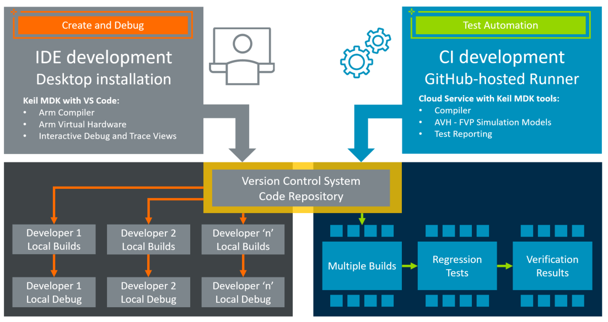

# AVH CI Template

This repository contains a **CI Template for unit test automation** that uses [GitHub Actions](https://github.com/features/actions) on a [GitHub-hosted runner](https://docs.github.com/en/actions/using-github-hosted-runners/about-github-hosted-runners/about-github-hosted-runners) with an Ubuntu Linux system. A report is optionally generated using  the [Unity test framework](https://github.com/MDK-Packs/Unity).

The tests run on [**Arm Virtual Hardware - Fixed Virtual Platforms (AVH-FVP)**](https://arm-software.github.io/AVH/main/simulation/html/index.html) which are simulation models that implement a Cortex-M, Corstone, or Cortex-M/Ethos-U device sub-systems. These models are designed for software verification and testing. It allows simulation-based test automation of various software workloads, including unit tests, integration tests, and fault injection.

The tools used in this **CI Template** are part of [Keil MDK Version 6](https://www.keil.arm.com/keil-mdk/). For evaluation purposes the *MDK - Community Edition* can be used, but commericial usage requires a license of the *MDK - Professional Edition*.
The tool installation is managed with [vcpkg](https://www.keil.arm.com/artifacts/) using a [configuration file](./vcpkg-configuration.json) that ensures consistent setup on Desktop computers and the CI system.

## Repository Structure

This is a template repository that can be used as starting point for validation projects. Click **Use this template - Create a new repository** to start your own CI test project.

Directory                     | Content
:-----------------------------|----------
[.github/workflows](.github/workflows) | Workflow YML files that gets you started with GitHub Actions for CMSIS projects.
[Project](Project)                     | A simple unit test application in [*csolution project format*](https://github.com/Open-CMSIS-Pack/cmsis-toolbox).

## Usage

The [Project](Project) tests a single function (*my_sum*) using the [Unity test framework](https://github.com/MDK-Packs/Unity) that is available as [CMSIS software pack](https://www.keil.arm.com/packs/unity-arm-packs). The initial configuration contains a "test case error" that exemplifies the Unity test reporting.

### GitHub

With GitHub Actions two workflows are available:

- [basic.yml](.github/workflows/basic.yml) compiles and runs the application.
- [basic_w_report.yml](.github/workflows/basic_w_report.yml) compiles and runs the application; then generates a test report using [phoenix-actions/test-reporting](https://github.com/phoenix-actions/test-reporting).

Use in the GitHub web interface the [*Actions*](/../../actions) view to execute the *CI test run* and get *Test results*.

### Desktop

**Prerequisite:**

- Install VS Code with [Arm Keil Studio Pack extensions](https://marketplace.visualstudio.com/items?itemName=Arm.keil-studio-pack).
- Click **Use this template - Create a new repository** to create you own CI test flow in your GitHub account.

**Build:**

In VS Code use:

- Open *Source Control Activity Bar* and use *Clone Repository* to get  the application on your local computer.
- Open *CMSIS Activity Bar* and *Build* the application.

> **Note:**
>
> When you open the project for the first time, the *Arm Tools Environment* managed with [vcpkg](https://www.keil.arm.com/artifacts/) gets installed which may take some minutes.

**Run:**

In VS Code open the *CMSIS Activity Bar* and *Run* the application.

**Debug:**

In VS Code open the *CMSIS Activity Bar* and *Debug* the application.

## More CI Examples

Arm is using CI validation tests for many projects. The list below are only a few examples that may be used to derive own CI test projects.

Resource           | Description
:------------------|:------------------
[CMSIS Version 6](https://github.com/ARM-software/CMSIS_6/actions) | Runs a CMSIS-Core validation test across the supported processors using multiple compilers.
[RTOS2 Validation](https://github.com/ARM-software/CMSIS-RTX/actions) | Runs the CMSIS-RTOS2 validation accross Keil RTX using source and library variants.
[TFL Micro Speech](https://github.com/arm-software/AVH-TFLmicrospeech) | This example project shows the Virtual Streaming Interface with Audio input and uses [software layers](https://github.com/Open-CMSIS-Pack/cmsis-toolbox/blob/main/docs/build-overview.md#software-layers) for retargeting.

## Other Developer Resources

Resource           | Description
:------------------|:------------------
[Documentation](https://arm-software.github.io/AVH/main/overview/html/index.html) | Is a comprehensive documentation about Arm Virtual Hardware.
[Support Forum](https://community.arm.com/support-forums/f/arm-virtual-hardware-targets-forum) | Arm Virtual Hardware is supported via a forum. Your feedback will influence future roadmap.
[AVH-MLOps](https://github.com/ARM-software/AVH-MLOps) | Shows the setup of a Docker container with foundation tools for CI and MLOps systems.
[Marketing Overview](https://www.arm.com/virtual-hardware) | Gives you a top-level marketing message.

## Related Webinar Recordings

- [MDK v6 Technical Deep Dive](https://on-demand.arm.com/flow/arm/devhub/sessionCatalog/page/pubSessCatalog/session/1713958336497001CQIR)
- [CLI builds using CMSIS-Toolbox](https://on-demand.arm.com/flow/arm/devhub/sessionCatalog/page/pubSessCatalog/session/1708432622207001feYV)
- [Using CMSIS-View and CMSIS-Compiler](https://on-demand.arm.com/flow/arm/devhub/sessionCatalog/page/pubSessCatalog/session/1706872120089001ictY)
- [Data streaming with CMSIS-Stream and SDS](https://on-demand.arm.com/flow/arm/devhub/sessionCatalog/page/pubSessCatalog/session/1709221848113001nOU5)
